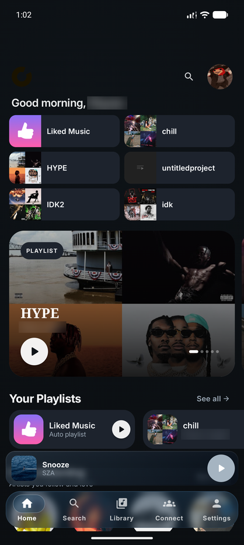
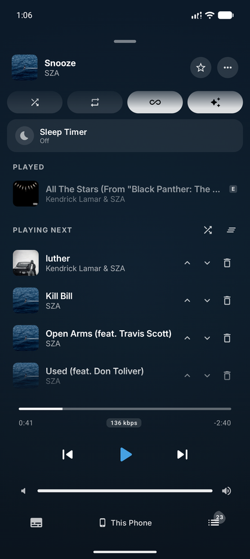
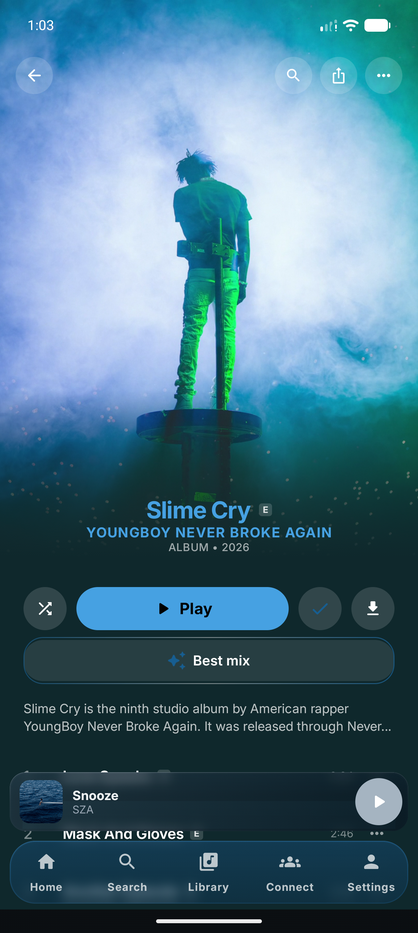

<div align="center">
  

  # Orchard

  ### A Power-User Desktop Client for YouTube Music

  **Beat-Matched Smart Crossfade • Best Mix Queueing • 10-Band Audiophile EQ • Orchard Connect • Local Replay • Listening Parties**

  <p align="center">
    <a href="https://sfg545.dev/orchard"></a>
    <a href="https://github.com/SFG5453/Orchard/releases"></a>
    <a href="LICENSE"></a>
    <a href="https://sfg545.dev/orchard"></a>
    <a href="https://ko-fi.com/sfg545"></a>
  </p>

  <p align="center">
    <a href="#download"><b>Download</b></a> •
    <a href="#features"><b>Features</b></a> •
    <a href="#smart-crossfade-in-action"><b>Smart Crossfade</b></a> •
    <a href="#orchard-mobile-for-android"><b>Android App</b></a> •
    <a href="#building-from-source"><b>Build</b></a> •
    <a href="https://github.com/SFG5453/Orchard/issues"><b>Issues</b></a>
  </p>
</div>

---

## Overview

**Orchard** is an open-source, high-performance YouTube Music desktop client built for listeners who demand more control over playback dynamics, sound quality, queue intelligence, and connected devices than the web player provides.

By pairing an embedded browser session with a native C++ audio engine and machine-learning analysis, Orchard delivers audiophile-grade processing, seamless DJ-style transitions, LAN multi-device sync, and deep desktop integration—all while honoring your existing library and playlists.

> [!NOTE]
> Orchard connects directly to YouTube Music via browser-backed InnerTube requests. It is an independent open-source project and is not affiliated with or endorsed by Google or YouTube.

---

## Highlights

| **Smart AutoMix Crossfade** | **Best Mix Queue Intelligence** | **Audiophile Audio Engine** |
| :--- | :--- | :--- |
| Beat-matched, phrase-aligned transitions with quantized downbeat sync, bass swaps, and filter sweeps. | Sort queues harmonically using Camelot musical keys and BPM for seamless flow between tracks. | 10-band manual EQ, Auto-EQ profiles, dynamic loudness leveling, and live real-time spectrum analysis. |

| **Orchard Connect Ecosystem** | **Local Replay & Discovery** | **First-Class Desktop Native** |
| :--- | :--- | :--- |
| Seamlessly hand off playback and control desktop sessions from Android or LAN web controllers. | Year-round offline listening stats, Release Radar, synced lyrics, and nearby live-show discovery. | Discord Rich Presence (with animated art), Last.fm scrobbling, local disk caching, and media keys. |

---

## Smart Crossfade in Action

Orchard reproduces beat-matched, phrase-aligned AutoMix transitions inspired by [Apple Music's AutoMix](https://support.apple.com/en-us/105067), utilizing 3-phase volume curves, progressive filter sweeps, downbeat quantization, and seamless bass frequency swaps.

https://github.com/user-attachments/assets/d846542c-b65a-44f3-809f-6a65527322a9

---

## Features

### Playback and Queues
* **Real Shuffle & Autoplay:** Eliminate YouTube's repetitive shuffle bias with true randomized or weighted queues.
* **Best Mix Queue Sorting:** Reorder any queue or playlist harmonically using BPM and musical key metadata.
* **Smart & Fixed Crossfade:** Seamless transitions with automatic tempo/beat alignment or configurable 1–12s fixed fades.
* **Song Caching & Prefetching:** Prefetches upcoming queue tracks to local disk for instantaneous, gapless playback.
* **State Persistence:** Automatically restores your exact queue, position, and playback context across restarts.
* **Desktop Controls:** Global media keys, customizable system tray menu, sleep timer, and fullscreen visualizer mode.

### Orchard Audio Engine
* **10-Band Graphic Equalizer:** Precision tuning with customizable frequency bands and profile import/export.
* **Auto-EQ Integration:** Apply tailored equalization profiles for hundreds of headphone and speaker models.
* **Dynamic Leveling & Gain Memory:** Automatic loudness normalization with persistent per-track gain calibration.
* **Live Spectrum Visualizer:** Real-time audio frequency visualizer rendered at 60+ FPS.
* **Output Device Routing:** Route music to dedicated DACs or audio outputs independently of OS system defaults.
* **Native C++ / N-API Analyzer:** Fast, low-latency DSP processing built directly in native code.

### Library, Lyrics, and Discovery
* **Full YouTube Music Integration:** Seamless browsing of Home, Search, Library, Playlists, Albums, Artists, and Podcasts.
* **Synced & Static Lyrics:** Real-time synchronized lyrics with multiple fallback resolvers.
* **Local Replay:** Private, on-device listening statistics for top tracks, artists, albums, and total listening time.
* **Release Radar & Radio:** Discover new drops from followed artists and personalized infinite radio stations.
* **Live Concert Discovery:** Find upcoming tour dates and live shows near you powered by Ticketmaster.

### Social and Connected Listening
* **Orchard Connect:** Secure, local-network remote control and playback handoff with Android devices and web companions.
* **P2P Listening Parties:** Listen together in real-time with friends over synchronized peer-to-peer audio sessions.
* **Discord Rich Presence:** Dynamic Discord status displaying current track, artist, album, and animated cover art.
* **Last.fm Scrobbling:** Real-time now-playing notifications and accurate play scrobbling.
* **Universal Song Links:** Generate shareable Orchard Song Links that bridge across music platforms.

### Appearance and Personalization
* **Adaptive Artwork UI:** Interface background dynamically shifts palette to match current album artwork.
* **OLED Dark Mode & System Themes:** Pitch-black OLED theme or automatic OS theme following.
* **Artist Packs:** Community-created custom skins, artwork variants, custom layouts, and ambient page effects.
* **Account Switching:** Fast multi-account switcher with cached sign-in credentials.

---

## Download

| **Stable Release** | **Latest Beta (Pre-Release)** | **Canary (Nightly / Automated)** |
| :--- | :--- | :--- |
| Recommended for general use. Thoroughly tested and verified. | Preview upcoming features, fixes, and experimental changes. | Automated, bleeding-edge builds straight from active development. |
| **[Download Stable](https://sfg545.dev/orchard)** | **[View Pre-Releases](https://github.com/SFG5453/Orchard/releases)** | **[Download Android Canary ZIP](https://nightly.link/SFG5453/Orchard/workflows/android-canary-build/canary/Orchard-Canary-APK.zip)** |

### Available Packages

| Platform | Package Formats | Architecture |
| :--- | :--- | :--- |
| **Windows** | NSIS Installer (`.exe`) | x64, arm64 |
| **Linux** | AppImage (`.AppImage`), Debian (`.deb`), RPM (`.rpm`), Arch Linux (`.pkg.tar.zst`) | x64, arm64 |
| **macOS** | ZIP Packages (`.zip`) | Apple Silicon, Intel |
| **Android** | Standalone APK (`.apk`), Canary ZIP (`.zip`) | arm64-v8a, armeabi-v7a, x86_64 |

Release files and `SHA256SUMS.txt` are also published at [downloads.sfg545.dev/orchard](https://downloads.sfg545.dev/orchard/).

> [!NOTE]
> Current Windows and macOS builds are unsigned. If your operating system displays a security prompt during the first launch, select **"More info" → "Run anyway"** (Windows) or allow it under **System Settings → Privacy & Security** (macOS).

---

## Orchard Mobile for Android

Orchard Mobile is Orchard's standalone companion app for Android—featuring on-device machine-learning track analysis, offline playback, Smart Crossfade, Android Auto, and seamless Orchard Connect handoff.

<div align="center">
  
  
  
  
  
</div>

<p align="center">
  <b>Explore the <a href="mobile/">Mobile Documentation & Source Code</a></b> • <b><a href="https://nightly.link/SFG5453/Orchard/workflows/android-canary-build/canary/Orchard-Canary-APK.zip">Download Canary ZIP</a></b>
</p>

### Pairing with Orchard Desktop
The mobile app can act as a standalone player or connect to your desktop session via **Orchard Connect**:
1. Open Orchard Desktop and navigate to the **Orchard Connect** pairing view.
2. On your phone, go to **Profile → Connected devices** (or the Now Playing device picker) and scan the QR code or paste the pairing link.
3. Approve the connection on the desktop client.
4. Seamlessly transfer playback between your phone and desktop over your local network.

---

## Building from Source

### Requirements
* **Node.js**: v24.x LTS and **npm**
* **Python**: 3.10+ (for `node-gyp`)
* **C++17 Toolchain**: GCC/Clang (Linux/macOS) or Visual Studio C++ Build Tools (Windows)

### Quick Start

1. **Clone the repository:**
   ```bash
   git clone https://github.com/SFG5453/Orchard.git
   cd Orchard
   ```

2. **Install dependencies:**
   ```bash
   npm ci
   ```

3. **Start in development mode:**
   ```bash
   npm run dev
   ```
   *This builds the native audio analyzer, starts Vite on `127.0.0.1:5173`, and launches Electron against the dev server.*

4. **Build the complete application:**
   ```bash
   npm run build
   ```

5. **Run tests:**
   ```bash
   npm test
   ```

### Useful Commands

| Command | Purpose |
| :--- | :--- |
| `npm run dev` | Launch Vite + Electron in development mode |
| `npm run build` | Full build (Native C++ DSP + Vue frontend + Electron main) |
| `npm run build:frontend` | Build only the Vue renderer bundle |
| `npm run build:native` | Compile the native audio-analysis C++ addon |
| `npm test` | Run complete Node test suite |
| `npm run test:native` | Run audio, transition planner, and native DSP tests |
| `npm run package:orchard` | Build package-service application archives |
| `npm run package:linux-system` | Stage application directory for system Electron |

---

## Project Structure

```text
orchard/
├── src/                         Vue renderer and application state
│   └── audio/                   Web Audio DSP engine and Smart Crossfade pipeline
├── electron/                    Electron main process
│   ├── main/                    Electron composition root
│   ├── preload/                 Sandboxed renderer IPC bridge
│   ├── audio/                   Native analysis and audio service bindings
│   ├── auth/                    Browser-backed YouTube authentication
│   ├── connect/                 Orchard Connect encrypted LAN WebSocket service
│   └── playback/                Stream resolution, caching, and proxying
├── native/                      C++ audio analyzer and N-API bindings
├── mobile/                      Native Android / Kotlin client (Jetpack Compose)
├── workers/                     Cloudflare Workers and Durable Objects for P2P sync
├── services/artwork-converter/  Animated-artwork conversion service
├── packaging/                   Linux packaging and runner assets
├── scripts/                     Build, launch, and release utilities
└── test/                        Node and native test suites
```

> **Security Note:** The renderer reaches privileged desktop functionality only through the sandboxed preload bridge. Catalog and playback requests use a loopback Socket.IO bridge, and Orchard Connect operates strictly over authenticated local network pairing.

---

## Contributing

Contributions, bug reports, and feature requests are welcome!

1. Fork the repository and create a feature branch (`git checkout -b feature/my-feature`).
2. Keep changes focused and clean.
3. Verify that tests pass (`npm test`).
4. Run `npm run build:frontend` for UI changes, or `npm run build` if native code is modified.
5. Submit a Pull Request with a clear description of your changes.

Use the [GitHub Issues](https://github.com/SFG5453/Orchard/issues) tracker for public bug reports and feature requests. Private reports with optional diagnostics can also be submitted through Orchard's in-app Support System.

---

## Support

If you enjoy using Orchard and would like to support its development, consider [buying me a coffee on Ko-fi](https://ko-fi.com/sfg545).

<p align="center">
  <a href="https://ko-fi.com/sfg545">
    
  </a>
</p>

---

## License and Acknowledgments

* **License:** Orchard is licensed under the [GNU Affero General Public License v3.0 or later](LICENSE). *(Releases up to and including 3.x were published under the MIT License and remain under those terms).*
* **BPM & Key Metadata:** Provided by [GetSongBPM](https://getsongbpm.com).
* **Beat Tracking:** Beat and downbeat tracking models inspired by and adapted from [Beat This!](https://github.com/CPJKU/beat_this).

---

<div align="center">
  <sub>Built by SFG545 and the Orchard Community.</sub>
</div>
