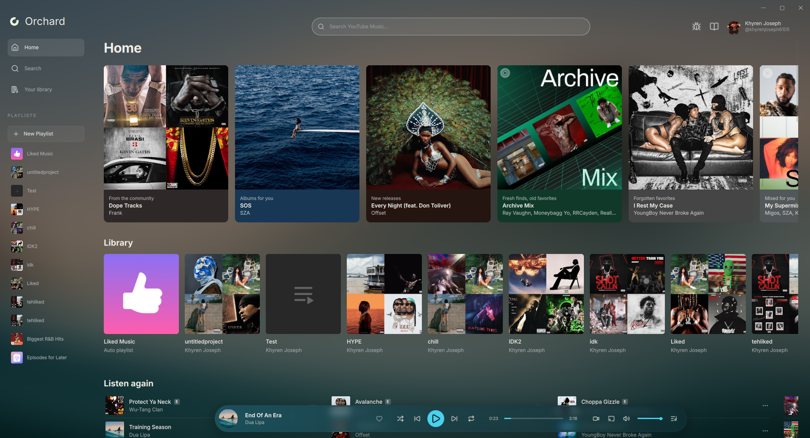
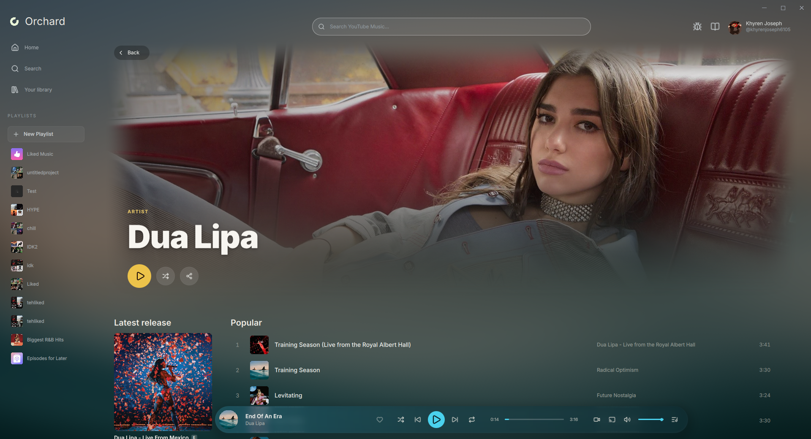
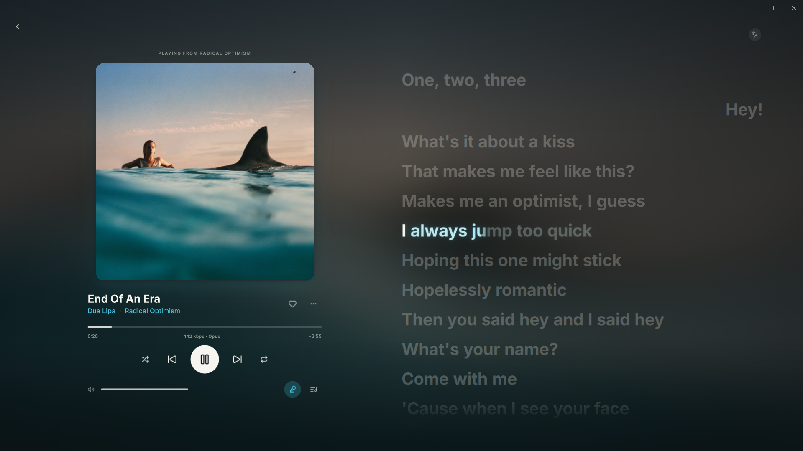

<div align="center">
  

# Orchard

**Your YouTube Music library, with more control over how you listen.**

Adaptive mixes · Best Mix queues · Synced lyrics · Lossless audio · Orchard Connect

  <p>
    <a href="https://sfg545.dev/orchard"></a>
    <a href="#download"></a>
    <a href="LICENSE"></a>
    <a href="https://ko-fi.com/sfg545"></a>
  </p>

  <p>
    <a href="#download"><b>Download</b></a> ·
    <a href="#features"><b>Features</b></a> ·
    <a href="#orchard-mobile-for-android"><b>Android app</b></a> ·
    <a href="#getting-started"><b>Getting started</b></a> ·
    <a href="#building-from-source"><b>Build</b></a>
  </p>
</div>

Orchard is an open-source music player for Windows, Linux, and Android. Browse your YouTube Music recommendations, library, and playlists, shape the sound, and move playback between your computer and phone. The desktop app uses a native Qt interface and Rust audio core.

Orchard is an independent project and is not affiliated with or endorsed by Google, YouTube, or Qobuz.

## Screenshots

<div align="center">
  
</div>

<table>
  <tr>
    <td width="50%"></td>
    <td width="50%"></td>
  </tr>
  <tr>
    <td align="center">Explore artists and their music</td>
    <td align="center">Follow along with synced lyrics</td>
  </tr>
</table>

## Download

**[Download Orchard](https://sfg545.dev/orchard)** for your device.

| Platform | Available packages |
| :--- | :--- |
| **Windows** | Setup installer (`.exe`) or portable archive (`.7z`), x64 |
| **Linux** | AppImage (`.AppImage`) or native Orchard launcher, x64 |
| **Android** | Standalone app (`.apk`), Android 12 or later |

The desktop installer downloads the app and its required components on first install. Managed desktop installs check for updates automatically and download the files that changed. See [Updates](docs/app/updates.md) for update settings and repair options.

To try desktop canary builds, turn on **Canary builds** under **Settings → General → Updates**. Canary builds follow active development and can have bugs. Turn the switch off to return to stable.

## Features

### Make the next song fit

- **Adaptive mix:** blends songs using beat and phrase alignment, bass swaps, and vocal-aware transitions. Analysis runs on your device.
- **Best Mix:** sorts upcoming songs by tempo, key, energy, and production style to make the queue flow.
- **Standard crossfade:** choose a fixed blend from 1 to 12 seconds.
- **Gapless playback and autoplay:** minimize pauses between tracks and keep listening when the queue ends.
- **Editable queue:** add, remove, and drag songs into the order you want.

Desktop Adaptive mix requires a GPU with WebGPU support and FFmpeg. Turn the Audio Engine off to enable it, and choose a streaming quality other than MAX. See [Crossfade and gapless playback](docs/app/crossfade.md) and [Manage the queue](docs/app/queue.md) for setup and requirements.

### Tune your sound

- **10-band equalizer:** use a preset or adjust each band yourself.
- **Automatic EQ and dynamic leveling:** balance the sound and reduce sudden volume jumps.
- **Per-song gain:** Orchard remembers your volume adjustment for each track.
- **Output device selection:** send Orchard to your speakers, headphones, or DAC.
- **Qobuz lossless and Hi-Res:** connect your own Qobuz subscription and select MAX quality. Matched songs play from Qobuz, with YouTube Music supplying your library and playlists.

See [Audio Engine and equalizer](docs/app/audio-engine.md) and [Streaming quality](docs/app/streaming-quality.md).

### Keep your music close

- **YouTube Music library:** browse Home, search, albums, artists, liked songs, and playlists.
- **Offline downloads:** save songs, albums, and playlists for listening without a connection.
- **Local files:** add music from your computer, make local playlists, and choose custom covers and lyrics.
- **Synced lyrics:** follow the song in the fullscreen player, with optional English translation.
- **Music videos:** switch from the song to its video and back at the same position.
- **Animated artwork:** moving covers and backgrounds that take their colors from the music.
- **AI-generated music detection:** choose to mark, skip, or remove songs that Orchard flags as likely AI-generated.

See [Offline mode and downloads](docs/app/offline-mode.md), [Local files](docs/app/local-files.md), [Lyrics](docs/app/lyrics.md), and [AI-generated music](docs/app/ai-music.md).

### Listen across devices

- **Orchard Connect:** control playback on your computer from your phone, or on your phone from your computer, on the same network or over the internet.
- **Desktop help for mobile mixes:** a connected computer can prepare Adaptive mixes while the phone keeps playing.
- **Discord Rich Presence:** show your current song and artwork on your profile.
- **Last.fm:** send your listening history to your Last.fm account.
- **Desktop controls:** keyboard shortcuts, media keys, and system tray support.

See [Orchard Connect](docs/app/connect.md), [Integrations](docs/app/integrations.md), and [Keyboard shortcuts](docs/app/shortcuts.md).

## Orchard Mobile for Android

Orchard Mobile plays music directly on your phone. It includes on-device Smart Crossfade, synced lyrics, animated artwork, Android Auto, Chromecast, and Orchard Connect.

<div align="center">
  
  
  
  
  
</div>

<p align="center">
  <a href="https://sfg545.dev/orchard"><b>Download for Android</b></a> ·
  <a href="mobile/README.md"><b>Mobile features and build instructions</b></a>
</p>

To connect your phone and computer:

1. Open Orchard on both devices.
2. Sign in to the same **Orchard account** on both devices in Settings.
3. On desktop, select the cast button in the player bar. On Android, open the device picker in the full player.
4. Select the device you want to control.

Your Orchard account connects the devices. Your YouTube Music and Qobuz sign-ins stay on their own device. See [Orchard Connect](docs/app/connect.md) for playback handoff and troubleshooting.

## Getting started

1. Install and open Orchard.
2. Select **Continue with Google** and finish signing in to YouTube Music.
3. Pick a song from **Home**, or search for an artist, album, or playlist.
4. Open **Settings** from your account button to choose playback quality, sound settings, and appearance.

On desktop, click the cover art in the player bar, or press **F**, to open the fullscreen player. Press **Space** to play or pause, and **Esc** to close it.

Select the **book icon** in the top bar to open the searchable in-app docs. You can also read the guides here:

| I want to… | Guide |
| :--- | :--- |
| Find my way around | [Getting started](docs/app/getting-started.md) |
| Find songs or open Settings quickly | [Search and Spotlight](docs/app/search.md) |
| Manage my library and playlists | [Library and playlists](docs/app/library-and-playlists.md) |
| Change the sound or transitions | [Audio Engine](docs/app/audio-engine.md) · [Crossfade](docs/app/crossfade.md) |
| Fix a playback or sign-in problem | [Troubleshooting](docs/app/troubleshooting.md) |
| Report a bug | [Report a bug](docs/app/report-a-bug.md) |

## Building from source

Desktop builds require Meson 1.12+, CMake 3.24+, Ninja, Qt 6.8+, a C++20 toolchain, Node.js/npm, and Rust 1.96+. Qt must include the Quick, QML, Network, Multimedia, WebView, and WebEngine modules. Platform dependencies and sign-in backend setup are in the [development guide](docs/DEVELOPMENT.md).

```sh
git clone --recurse-submodules https://github.com/SFG5453/orchard-v4.git
cd orchard-v4
npm ci --prefix providers/youtube
meson setup build/dev --buildtype debug
meson compile -C build/dev
./build/dev/orchard
```

Run the desktop tests with:

```sh
meson test -C build/dev --print-errorlogs
```

For cross compilation, provider checks, release publishing, and in-app documentation rules, see [Development](docs/DEVELOPMENT.md). Android build instructions are in the [mobile README](mobile/README.md).

## Contributing and support

Bug reports, feature requests, and contributions are welcome. Use the in-app bug-report button or [GitHub Issues](https://github.com/SFG5453/orchard-v4/issues), and include your Orchard version, operating system, and steps to reproduce the problem.

For code changes, follow [Contributing](contributing.md) and [AGENTS.md](AGENTS.md), and run the checks relevant to your changes.

If you would like to support development, [buy me a coffee on Ko-fi](https://ko-fi.com/sfg545).

## License and acknowledgments

Orchard is free software under the [GNU Affero General Public License v3.0 or later](LICENSE).

Orchard uses open-source libraries and models for playback, analysis, artwork, and connected listening. See [Third-party notices](THIRD_PARTY_NOTICES.md), [Adaptive mix](crates/orchard-adaptive-mix/README.md), and the [mobile credits](mobile/README.md#third-party-components) for licenses and model provenance.
