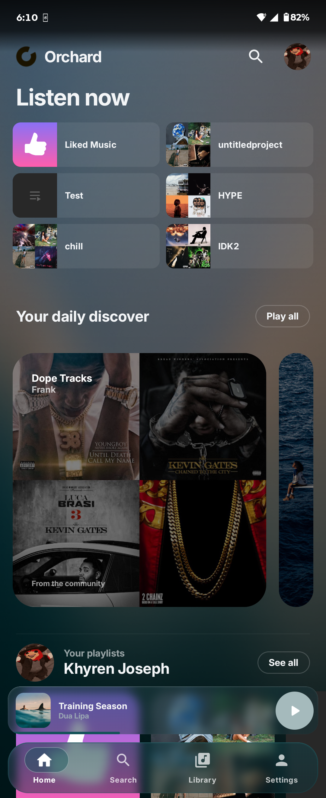
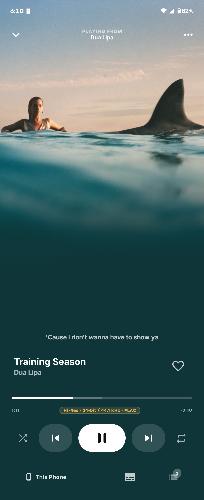
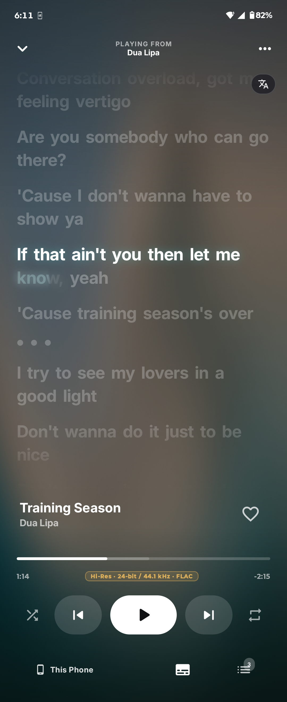
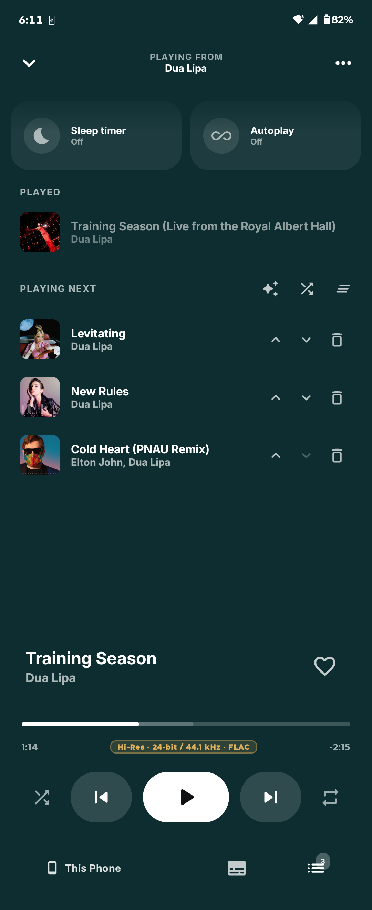
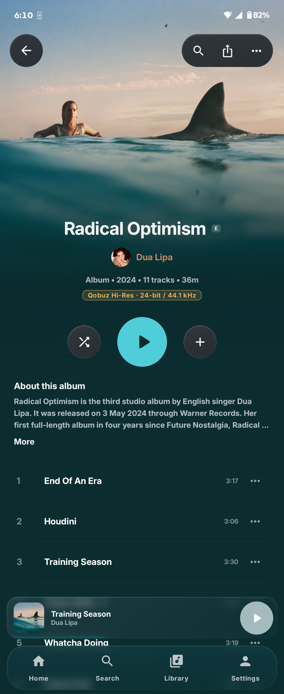

<div align="center">
  

# Orchard Mobile

**A power-user Android client for YouTube Music.**

Smart Crossfade with real beat matching, on-device track analysis, synced lyrics, animated artwork, Android Auto, Orchard Connect, and a full library that works signed in or signed out.

[](LICENSE)
[](#install)
[](https://ko-fi.com/sfg545)

[Orchard for desktop](../) · [Report an issue](https://github.com/SFG5453/Orchard/issues) · [Support on Ko-fi](https://ko-fi.com/sfg545)

</div>

---

Orchard Mobile is the phone half of [Orchard](../) — a standalone native Android app, not a remote control for the desktop client. It plays music on its own, keeps its own library, and signs into YouTube Music directly. Orchard is not affiliated with or endorsed by YouTube or Google.

## Why Orchard Mobile?

* **Transitions that actually mix.** Smart Crossfade analyzes both tracks on the device, finds the downbeat, time-stretches one to meet the other, and rides a filter through the blend. When the evidence isn't there, it falls back to a normal fade.
* **It does the analysis itself.** Beat grids, tempo, key, energy, and vocal presence are computed on the phone from the audio.
* **Everything the phone can show.** Synced lyrics, animated cover art when a provider has it, artwork-derived accent colors, and offline caching for instant replays.

## Screenshots

<div align="center">
  
  
  
  
  
</div>

## Features

### Playback

* Smart Crossfade with beat-matched, phrase-aligned transitions, or a fixed crossfade of 1–12 seconds
* Gapless playback for albums played in order
* Queue with reordering, removal, history, and restore after the app is killed
* Media notification, lock-screen controls, headset and Bluetooth buttons, audio focus
* Exponential volume for finer control at low media-volume levels, available in Audio settings and welcome setup, saved and off by default
* Artwork-tinted home-screen widgets for playback controls and recent tracks
* Android Auto browsing and voice search
* Playback history
* Skip non-music parts (talking intros, skits, applause) from SponsorBlock, as a button or automatically, with lyrics staying in sync

### On-device analysis

Orchard listens to the audio rather than trusting a catalog. Smart Crossfade and Best Mix run the desktop adaptive-mix worker's own Rust (`crates/orchard-adaptive-mix`) in process: Earmark's beat tracker and analysis, a quantized [Beat This!](https://github.com/CPJKU/beat_this) bar-phase check, open-unmix vocals, the QuickJS planner (`crates/orchard-transition-planner`) and the Earmark render. Kotlin only decodes the songs at their native rate and splices the rendered overlap into ExoPlayer (`MixSplicer`), so a pair mixes and a queue sorts as it does on desktop. The decoder (MediaCodec here, FFmpeg there) and the model weights (INT8 here) are the only differences.

### Library and browsing

* Home, search, library, playlists, albums, and artists
* Native YouTube Music sign-in through a dedicated Compose screen - sign in for your library, or skip it and browse as a guest
* Offline metadata cache and a configurable audio cache for instant re-listens
* Synced and unsynced lyrics from Orchard's resolver chain

### Connected listening

* **Orchard Connect** - control Orchard desktop from the phone or the phone from the desktop, on the same Wi-Fi or across the internet, while a connected desktop prepares Smart Crossfades and artwork for the phone
* **Chromecast** - move the active queue to Cast speakers and displays, then bring it back without losing position
* **Last.fm and ListenBrainz** - encrypted account credentials, now-playing updates, and seek-resistant scrobbling
* **Orchard account** - Google sign-in, an encrypted device session, and device management in Settings
* Discord Rich Presence, with animated artwork where available and an artist portrait over the cover
* Shareable song.link and album.link URLs, matching desktop

## Install

- Download the latest apk at https://sfg545.dev/orchard

Catalog, library, lyrics and stream URLs come from the desktop YouTube provider (`providers/youtube`), run in the same QuickJS build as desktop. Gradle bundles it with npm and compiles it with the host `qjsc`, so install its dependencies first (Node.js 24.11+, CMake):

```bash
npm ci --prefix providers/youtube
cd mobile/android
./gradlew assembleDebug
adb install -r app/build/outputs/apk/debug/app-debug.apk
```

Launch **Orchard** from the app drawer. Sign in from **Profile → Account** to play songs and load your library; playback requires a YouTube session, as on desktop.

Release builds are signed from `ANDROID_KEYSTORE_FILE`, `ANDROID_KEYSTORE_PASSWORD`, `ANDROID_KEY_ALIAS`, and `ANDROID_KEY_PASSWORD`:

```bash
./gradlew assembleRelease
```

## Orchard Connect

Sign in to the same Orchard account on the phone and the desktop. Each one then lists the other: on the phone, open the devices sheet from the full player; on the desktop, select the cast button in the player bar. Pick a device to play there, and pick this phone to bring playback home.

The account service introduces the devices and hands both a fresh session key. They connect directly on the local network when they can and over WebRTC otherwise, and prove that key to each other before anything else crosses. When the desktop controls a playing phone, the phone sends each pair of songs to the desktop, which plans and renders the Smart Crossfade and sends the blend back; the phone still plays it on its own clock, and mixes for itself whenever the desktop is gone. Qobuz and YouTube sign-ins never leave their device.

Phone and desktop run the same C++ protocol core (`core/native/connect`), reached here through JNI. See [docs/CONNECT.md](../docs/CONNECT.md).

## Development

```bash
cd android
./gradlew testDebugUnitTest assembleDebug lintDebug
```

The unit suite covers auth signing, queue edits and restoration, playback state, artwork matching, transition filtering and planning, the Connect wire format, remote commands and transfers, and remote mixes. The protocol itself is tested once, on desktop, with two real nodes talking over loopback sockets and WebRTC. Instrumented tests cover the analysis models, which need a real device.

Deeper notes live in [the beat model's provenance](docs/BEAT_MODEL.md).

### Project map

```text
android/app/src/main/java/dev/sfg/orchard/
  mobile/playback/    Media3 service, stream resolution, queue rules
  mobile/playback/smart/  Analysis, transition planning, rendering
  mobile/catalog/     YouTube Music API boundary
  mobile/artwork/     Static and animated cover art providers
  mobile/auth/        Cookie-session auth and Keystore storage
  mobile/lyrics/      Lyrics resolver chain
  mobile/connect/     Orchard Connect: hub socket, target, provider and mix host clients
  mobile/lastfm/      Last.fm authorization and scrobbling
  mobile/listenbrainz/ Direct ListenBrainz submission
  mobile/ui/          Compose theme, navigation, screens
  connect/app/        Launcher activity
android/app/src/main/cpp/
  connect/            JNI bridge to the shared Orchard Connect core
  analyzer/           Log-mel front end and tempo analysis
  transition/         Time-stretch and transition rendering
```

## Support

If you enjoy using Orchard Mobile and would like to support its development, consider [buying me a coffee on Ko-fi](https://ko-fi.com/sfg545).

## License

Orchard Mobile is free software under the [GNU Affero General Public License v3.0 or later](LICENSE).

Copyright © 2026 SFG545.

AGPL rather than GPL so code can move freely between here and Orchard desktop, which is also AGPL-3.0. The native analysis front end and the transition engine are both shared source, and more is expected to be.

### Third-party components

Smart Crossfade ships trained models. Both were chosen because their **weights**, carry a permissive license. Most published music-information-retrieval weights, Essentia's included, are CC BY-NC-SA and cannot be distributed in an application.

* **[Beat This!](https://github.com/CPJKU/beat_this)** (Foscarin, Schlüter & Widmer, ISMIR 2024) — beat and downbeat tracking. Code and weights both MIT. Mobile ships the official `final0` checkpoint converted to ONNX and quantized to int8 for CPU inference. See [docs/BEAT_MODEL.md](docs/BEAT_MODEL.md).
* **open-unmix** (Stöter & Liutkus, Inria/SigSep) — used only to measure how much vocal content is present at a given instant. Code and the umxhq weights both MIT, confirmed on the weights' own [Zenodo deposit](https://zenodo.org/record/3370489). Only the `vocals` target ships. Meta's htdemucs separates better but releases its weights under CC-BY-NC-4.0, which a distributed app cannot ship.
* **ONNX Runtime** (Microsoft) — MIT.
* **[QuickJS-ng](https://github.com/quickjs-ng/quickjs)**: runs the shared provider and planner JavaScript, from `third_party/quickjs`. MIT.
* **[SimpMusic](https://github.com/maxrave-dev/SimpMusic)** (maxrave-dev): the full-bleed player's smoothstep scrim and canvas layout are adapted from SimpMusic v2.2.0. GPL-3.0, combined under AGPL-3.0 section 13. See `ui/components/SmoothScrim.kt`.
* **[libdatachannel](https://github.com/paullouisageneau/libdatachannel)** (Paul-Louis Ageneau): Orchard Connect's WebSocket and WebRTC data channel transports, from `third_party/libdatachannel` with its bundled libjuice, usrsctp and plog. MPL-2.0, with libjuice under MPL-2.0, usrsctp under BSD-3-Clause and plog under MIT.
* **[Mbed TLS](https://github.com/Mbed-TLS/mbedtls)**: DTLS for the data channel, and the HKDF, HMAC and ChaCha20-Poly1305 behind Connect's session encryption, from `third_party/mbedtls`. Apache-2.0 OR GPL-2.0-or-later; Orchard uses it under Apache-2.0.
* **[nlohmann/json](https://github.com/nlohmann/json)**: JSON in the Connect core, from `third_party/json`. MIT.
* **earmark** — the beat-aware crossfade engine that plans and renders every transition, shared with Orchard desktop and vendored at `crates/earmark`. MIT OR Apache-2.0. It reaches Kotlin through JNI and time-stretches with [Signalsmith Stretch](https://github.com/Signalsmith-Audio/signalsmith-stretch) (MIT).
